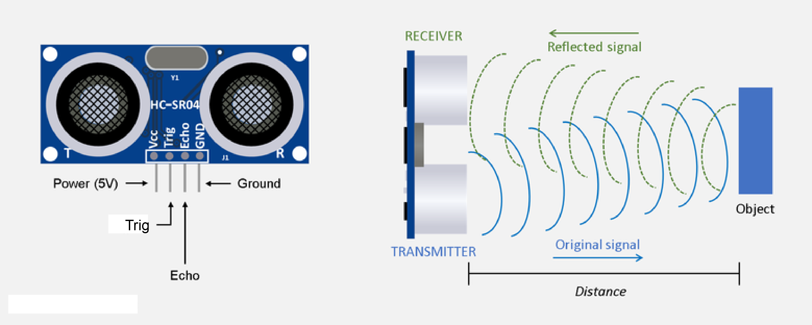
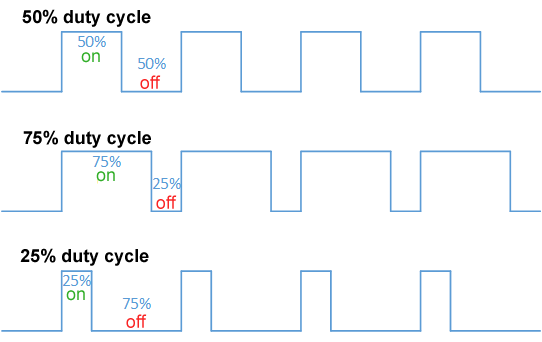

# Obstacle avoiding vehicle
An Ultrsonic sensor can be used to detect the presence of objects around a vehicle and send signals whenever it does.  A microcontroller such as an Arduino can use this signals to veer the vehicle so as to avoid collision with nearby object. Here, such a sensor is used to detect obstacles lying in front of the vehicle and an Arduino Uno is used to change the course of the vehicle to avoid collision with the obstacle.

## What is... 
### 1. Ultrasonic sensor
<p>An ultrasonic sensor is a sensor that emits ultrasonic waves at 40,000 Hz. These waves on striking an object is reflected back to the sensor. The time taken between the emmision and reception of the signal can be used to find the distance between the sensor and the object.</p>
</br>
<p align="left">
  
</p>
</br>

### 2. pulseIn() function
<p>"pulseIn() function is used to measure the time for which a pin remains in a certian state(HIGH or LOW). It take in two parameters: the pin whose state must be tracked and the state of the pin for which time should be measured. It returns time in microseconds.</p>

### 3. PWM
<p>Which stands for pulse width modulation is a process of varying the time for which a pulse remains ON. This way the average power delivered by a signal can be controlled. The longer the pulse remains ON compared to its OFF time, the higher the total power supplied to the load.</p>
<p>Duty cyle represents the proportion of ON time of a pulse to its total time period. It is represented in percentage.</p>
</br>

<p align="left">
  
</p>
</br>
An Arduino uno has 6 PWM output pins (3,5,6,9,10,11) labeled with ~ sign. PWM signals can be given using the in-built function "analogWrite()" in Arduino IDE.
</br>

### 4. L298N
<p>L298N is a dual channel motor driver. The H bridge is used to control the direction of the motors by provding HIGH(1) and LOW(0) signals to the direction control pins (IN1,IN2,IN3,IN4).The speed can be controlled by proving PWM signals to these pins.</p>
<p align="left">
  
</p>

## Components and supplies
<ul>
<li>Ultrasonic Sensor x 1</li>
<li>Arduino Uno X 1</li>
<li>DC motor(generic) X 4</li>
<li>Jumper wires(generic) X 1</li>
<li>L298N motor driver X 1</li>
<li>USB A to B cable X 1</li>
</ul>

## Working
<p>The trigger pin of the ultrasonic sensor is set at HIGH state for 10&micros. This send 8 short burst pulses at the speed of sound from the sensor. These pulses on striking an obstacle are returned back and is received by the echo pin. The echo pin remains at HIGH for the time taken for the pulses to travel to and fro. The "pulseIn()" function is used to measure the time for which echo pin is at HIGH. This time is measured in microseconds which lets consider as <em>tp</em></p>
<p>Speed of sound in air is 340m/s or 0.034cm/&micros thus the distance between obstacle and sensor is found as <strong>  tp*0.034/2  </strong> where distance is obtained in cm.</p>
<p>The distance between the vehicle and the sensor is continuously calculated by the Arduino and when the distance is less than sertain threshold, it means that an obstacle is nearby. The microcontroller then changes the course of the vehicle by turning it left or right by controlling the motor rotation direction through the motor driver.

## Code
Code used to program the arduino
<details>
<summary>Click to expand code...</summary>
<p>

```c++
#include "pinsUsed.h"

long duration;
int distance;

void setup() {
  pinMode(trig_pin,OUTPUT); // sensor trigger pin
  pinMode(echo_pin,INPUT); // sensor echo pin
  
  pinMode(rf_pin,OUTPUT);
  pinMode(rr_pin,OUTPUT);
  pinMode(lf_pin,OUTPUT);
  pinMode(lr_pin,OUTPUT);
  Serial.begin(9600);
}

#include "vehicleCommands.h"

void loop() {
  digitalWrite(trig_pin,LOW);
  delayMicroseconds(2);
  digitalWrite(trig_pin,HIGH);
  delayMicroseconds(10);
  digitalWrite(trig_pin,LOW);
  duration = pulseIn(echo_pin,HIGH); // find the duration 
  distance = (duration*0.034)/2; // find the distance between the sensor and the obstacle

  if(distance<max_distance){
    goRight();
  }
  else{
    goForward();
  }
}
```

</p>
</details>

## Resources
<ul>
<li>IR Sensor: https://medium.com/illumination/arduino-with-infrared-sensor-48ad4415f320</li>
<li>pulseIN(): https://www.arduino.cc/reference/en/language/functions/advanced-io/pulsein/
<li>PWM: https://create.arduino.cc/projecthub/muhammad-aqib/arduino-pwm-tutorial-ae9d71</li>
<li>L298N: https://lastminuteengineers.com/l298n-dc-stepper-driver-arduino-tutorial/</li>
</ul>